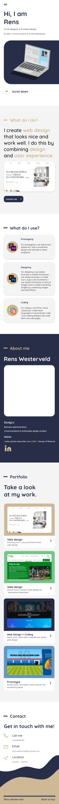
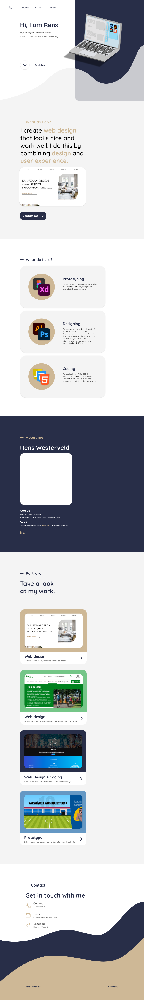

**Auteur:** Rens Westerveld

## Portfolio plan

  
Voor mij SRP punt wilde ik een nieuw portfolio gaan maken. Ik ben eerst begonnen met het uitwerken van mijn design in Adobe XD
  en heb deze vervolgens opgesplits in secties om mijn HTML code structuur te kunnen maken. Ik heb eerst de "homepage" uitgewerkt in code en ben daarna de detailpagina's van mijn 4 portfolio werken gaan designen en uitwerken in code.

  ### Design:
  
  

  ## Leerpunten/Geleerd:
  - Beter nadenken over de opbouw van de HTML voor telefoon (Omdat ik verwacht dat een portfolio op een dekstop wordt bekeken ben ik dit keer dekstop first gaan ontwerpen, maar heb ik niet stilgestaan bij de verandering van de navigatie op telefoon formaat.)

  - Ik ben beter geworden in het gebruik van grid. Voorheen gebruikte ik het liefst voor alles een display: flex, maar hier zag ik mogelijkheden om dit beter in een grid te zetten en om hiervan te leren.
  - Werken met breakpoints.
  - Controleren van responsiveness op "alle" devices.
  - 3D illustratie maken.
  - Geleerd dat niet elk scherm even goed contrast heeft dus dat je daar rekening mee moet houden in kleurgebruik.
  - Om de beperkingen van oude/andere browser versies werken.

